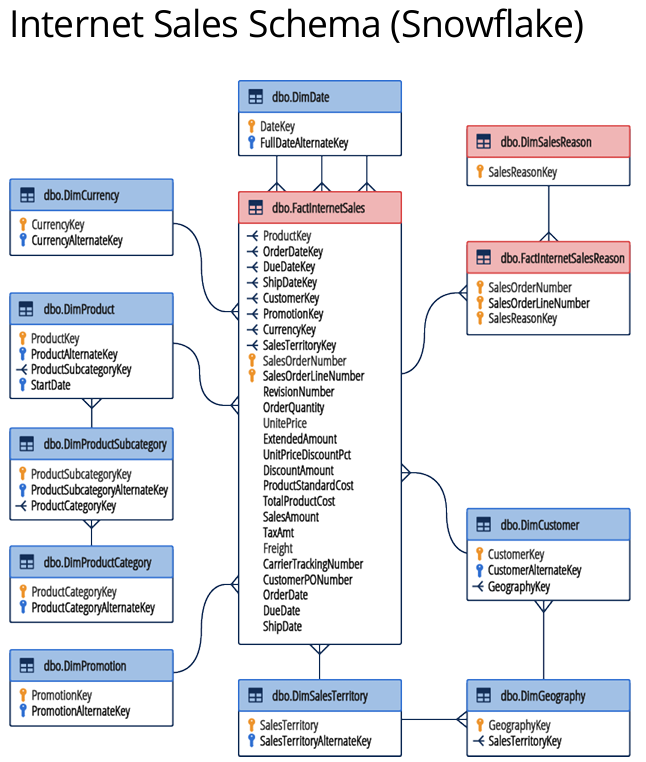
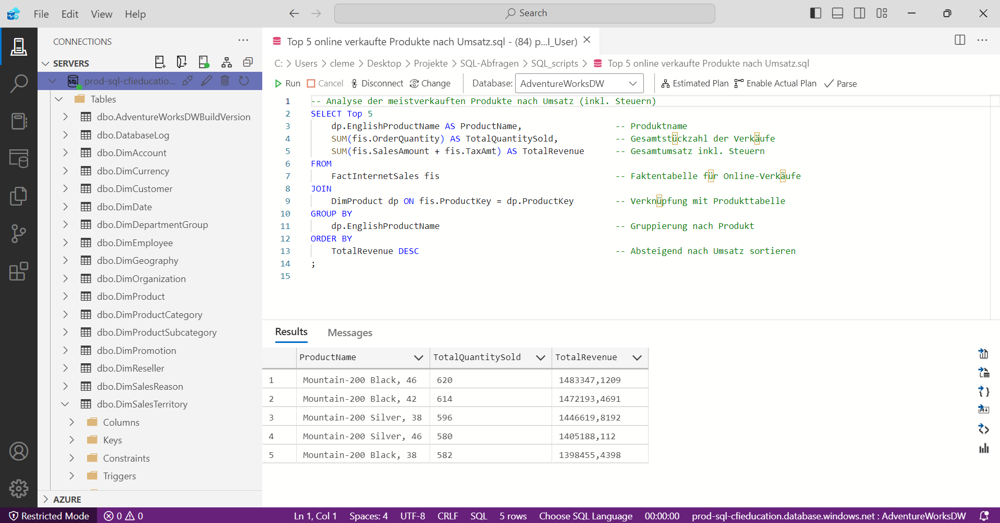

# SQL-Abfragen
Anwendung von SQL und Azure Data Studio zur gezielten Abfrage und Auswertung von Unternehmensdaten aus relationalen Datenbanken.
## Übersicht
Dieses Projekt wurde im Rahmen der Online-Weiterbildung „SQL Fundamentals for Data Analysts“ des Corporate Finance Institute auf der Plattform Coursera durchgeführt. Ziel des Projekts ist es, die in der Weiterbildung erworbenen Kenntnisse anzuwenden, um gezielte Daten aus der Datenbank des fiktiven Unternehmens „Adventure Works“ abzufragen und auszuwerten. Adventure Works ist ein multinationaler Hersteller von Metall- und Verbundfahrrädern mit 290 Mitarbeitenden. Das Unternehmen ist in den nordamerikanischen, europäischen und australischen Märkten tätig und verfügt über mehrere regionale Vertriebsteams. Das Unternehmen verfolgt das Ziel, seinen Marktanteil durch gezieltere Vertriebsmaßnahmen zu erhöhen und die Produktverfügbarkeit über eine externe Website auszubauen.
 
## Daten 
Die Daten stammen aus dem im oben genannten Kurs bereitgestellten Material. Die erforderlichen Informationen zur Verbindung mit der Unternehmensdatenbank befinden sich in der Datei 'SQL Credentials.txt'. Vor Beginn der Arbeit ist die Installation von Azure Data Studio notwendig. Das ERM-Diagramm veranschaulicht die in diesem Projekt verwendeten Tabellen sowie deren Beziehungen zueinander.

## Ergebnis
In diesem Projekt wurden fünf gezielte SQL-Abfragen durchgeführt, um folgende wichtige Fragestellungen zu beantworten:
1. Welche Kunden haben im Jahr 2013 überdurchschnittlich viel online ausgegeben (inkl. Steuern)? 
2. Wie entwickeln sich die monatlichen Online-Bestellzahlen, Bestellmengen und Umsätze (inkl. Steuern) über die Jahre hinweg? 
3. Wie verteilt sich der Online-Gesamtumsatz (inkl. Steuern) im Jahr 2013 auf Produktkategorien und Subkategorien, und welchen Anteil trägt jede Gruppe am Gesamtumsatz bei? 
4. Wie verteilen sich Online-Bestellungen, Mengen und Umsätze (inkl. Steuern) im Jahr 2013 auf verschiedene Verkaufsregionen und Länder?  
5. Welche fünf Produkte erzielten den höchsten Online-Umsatz (inkl. Steuern), und wie viele Einheiten wurden davon verkauft?

Die zugehörigen SQL-Skripte liegen im Ordner SQL_scripts. Unten ist ein Screenshot der Ausführung der Abfrage zur fünften Frage dargestellt.

## Fazit
